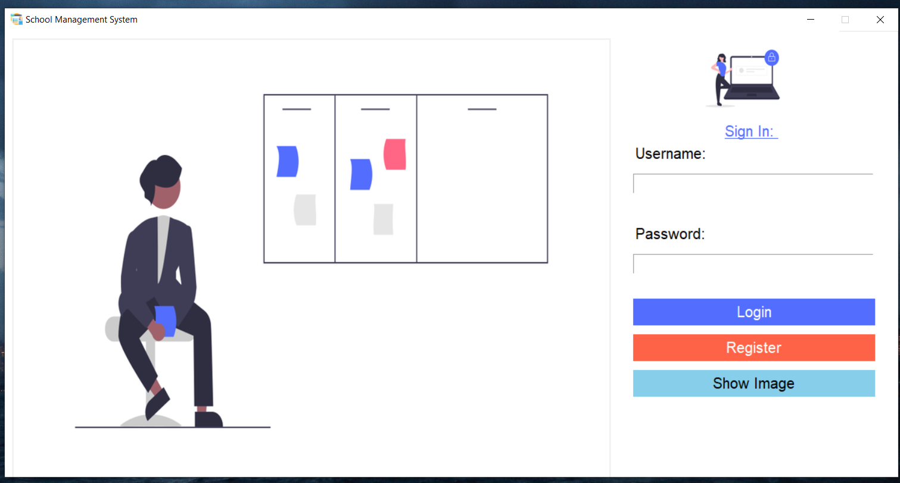
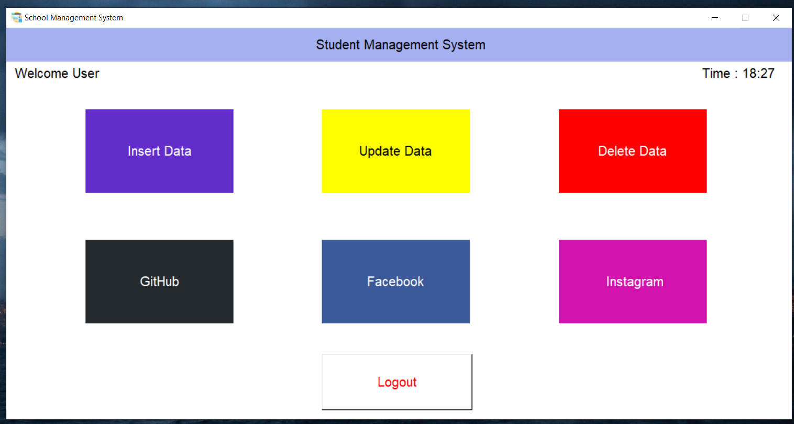
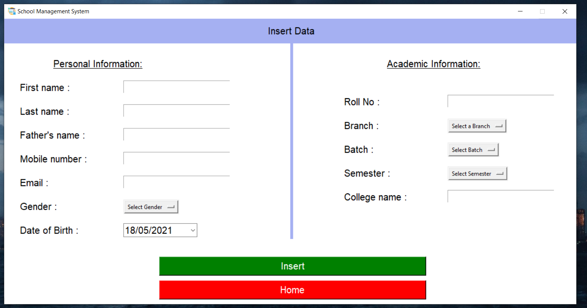
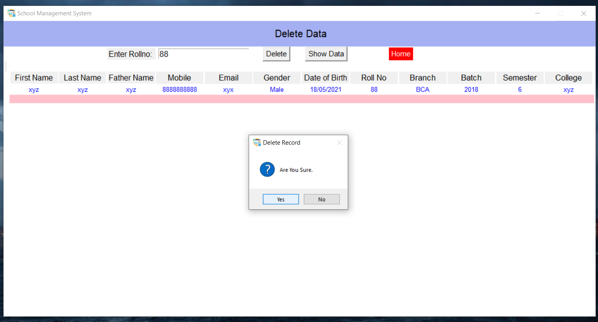

# Management-System-Tkinter-Project
Management System build with Tkinter using Python

<h3>My SQL setup </h3>
<ol>
  <li>Change SQL connection in main.py on line 27 
  conn = mysql.connector.connect(host="localhost", user="root", passwd="Sahil@123", database="studentrecord")</li>
  <li>create database studentrecord;</li>
  <li>With two table : adminrecord & studentinfo 
  =>create table adminrecord (username varchar(50), password varchar(50), email varchar(50), mobile int(10)); 
  =>create table studentinfo(firstname varchar (50), lastname varchar(50), fathername varchar(50), mobile int(10), email varchar(50), gender varchar(10), dateofbirth varchar(50), rollno bigint, branch varchar(50), batch bigint, semester int, clgname varchar(100));</li>
</ol>

<h3>Install these packages:</h3>
=>from tkinter import * 
=>from tkinter import ttk 
=>from tkinter import messagebox 
=>import mysql.connector 
=>import time 
=>import webbrowser 
=>from PIL import ImageTk, Image 
=>from tkcalendar import DateEntry 

<h3>Contributions you can do:-</h3>
<ol>
  <li>Exception for input fields. such as numeric value, string value.</li>
  <li>Image bug which removes image, when he logout or go back from register page.</li>
  <li><b>Most Important: </b>Update Delete Page, ever time a user delete a record from it.</li>
 </ol>
 

<h3>Screenshots:</h3>
</img>
</img>
</img>
</img>
</img>

<h3>Thank you for viewing my Project.</h3>
